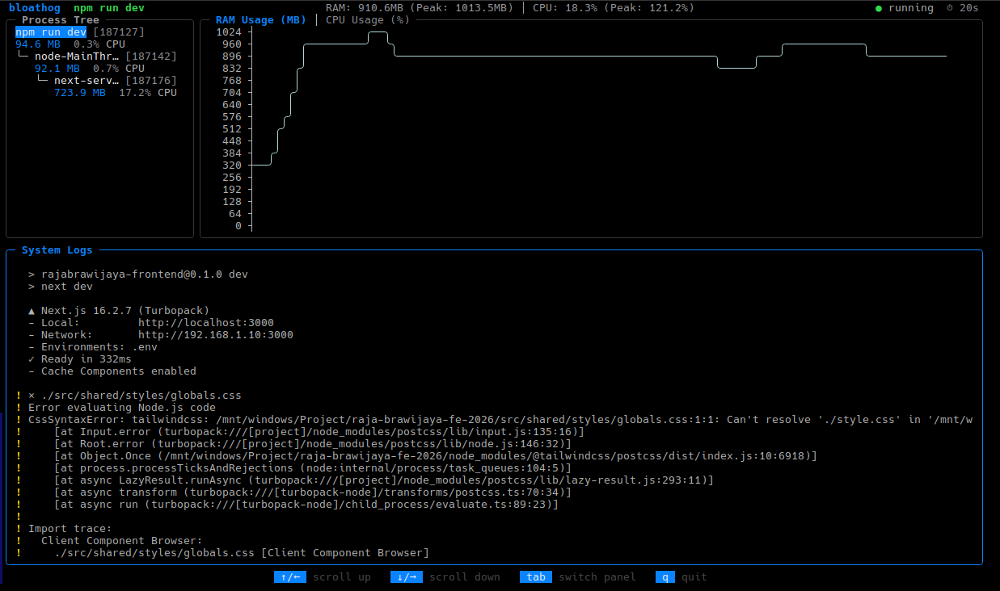

<div align="center">
  <h1>Bloathog</h1>
  <p><b>Wrap your dev server. Watch it eat RAM and CPU. In real time.</b></p>
  
  <br>
  <br>
</div>

<div align="center">
  <a href="https://github.com/dirgaa/bloathog/releases"></a>
  <a href="https://goreportcard.com/report/github.com/dirgaa/bloathog"></a>
  <a href="https://github.com/dirgaa/bloathog/blob/main/LICENSE"></a>
  <a href="https://github.com/dirgaa/bloathog/issues"></a>
</div>

---

## Table of Contents

- [Table of Contents](#table-of-contents)
- [What is Bloathog?](#what-is-bloathog)
- [Why Bloathog?](#why-bloathog)
- [Features](#features)
- [Installation](#installation)
  - [Pre-compiled Binaries](#pre-compiled-binaries)
  - [Package Managers](#package-managers)
  - [Build from Source](#build-from-source)
- [Usage](#usage)
  - [Manual Override](#manual-override)
- [Keybindings](#keybindings)
- [Contributing](#contributing)
- [License](#license)

## What is Bloathog?

`bloathog` is a fast, interactive CLI tool based on **Go** and **Bubble Tea** for real-time resource monitoring. 

It wraps your command (like `npm run dev` or `go run main.go`), spawning it as a child process. It then continuously monitors the entire OS process tree originating from that command, accurately aggregating the combined RAM (RSS) and CPU footprint of the parent and all its child processes in real-time.

## Why Bloathog?

Modern development tools (especially in the JavaScript/TypeScript ecosystem with tools like Next.js, Webpack, and Vite) tend to spawn dozens of worker threads and detached background processes. 

Standard monitoring tools like `top` or `htop` only show memory usage per individual PID. This makes it incredibly difficult to understand the **true total memory cost** of running your development server. `bloathog` solves this by natively tracking the entire process tree down to the last leaf, giving you the real, aggregate number.

## Features

- **Zero-Config Auto-detect:** Automatically detects JavaScript/TypeScript projects (`package.json`, `deno.json`) and infers the correct package manager.
- **Universal Tracking:** Wraps ANY framework or programming language (Node.js, Go, Python, Rust, PHP, etc.).
- **True Process Tree Aggregation:** Measures the combined RSS & CPU of all descendant processes, preventing hidden memory leaks.
- **Live Terminal Graph:** Streams a beautiful ASCII graph of your resource usage (`asciigraph`).
- **Streaming Stats:** Calculates current, peak, and average resource consumption with an O(1) memory footprint.
- **Interactive TUI:** Scrollable application output logs with follow mode and responsive panels.

## Installation

### Pre-compiled Binaries

Our installation script (macOS / Linux):
```bash
curl -sSL https://raw.githubusercontent.com/dirgaa/bloathog/main/install.sh | sh
```

### Package Managers

**NPM (Node.js)**
```bash
npx bloathog
# or install globally:
npm install -g bloathog
```

other package manager coming soon...

### Build from Source

**Go Install**
```bash
go install github.com/dirgaa/bloathog/cmd/bloathog
```

**Clone and Build**
```bash
git clone https://github.com/dirgaa/bloathog.git
cd bloathog
go build -ldflags="-s -w" -trimpath -o bloathog ./cmd/bloathog
```

The binary will be created in the current directory. Move it somewhere in your `$PATH` to use it globally

## Usage

If you are in a JavaScript/TypeScript project directory, simply run:

```bash
bloathog
```
*It will automatically detect `package.json`, check your lockfiles (`package-lock.json`, `pnpm-lock.yaml`, etc.), and execute the `dev` script.*

### Manual Override

You can manually wrap any command from any language:

```bash
# Node.js Ecosystem
bloathog bun run dev
bloathog pnpm run start

# Other Languages
bloathog python3 app.py
bloathog go run main.go
bloathog php -S localhost:8000
```

## Keybindings

| Key            | Action                                                     |
| -------------- | ---------------------------------------------------------- |
| `tab`          | Switch focus (Graph ↔ Log ↔ Process Tree)                  |
| `←` / `→`      | Switch between RAM and CPU Graph *(when Graph is focused)* |
| `↑` / `←`      | Scroll panel up                                            |
| `↓` / `→`      | Scroll panel down                                          |
| `q` / `ctrl+c` | Quit and print exit summary                                |

## Contributing

Contributions are welcome! If you find a bug or have a feature request, please [open an issue](https://github.com/dirgaa/bloathog/issues) or submit a Pull Request.

Please read our [Architecture Guide](docs/ARCHITECTURE.md) to understand the internal design before submitting code changes.

Have questions? Feel free to email me at [dirgayuditama6@gmail.com](mailto:dirgayuditama6@gmail.com)

## License

This project is open-source and licensed under the [MIT License](LICENSE).
